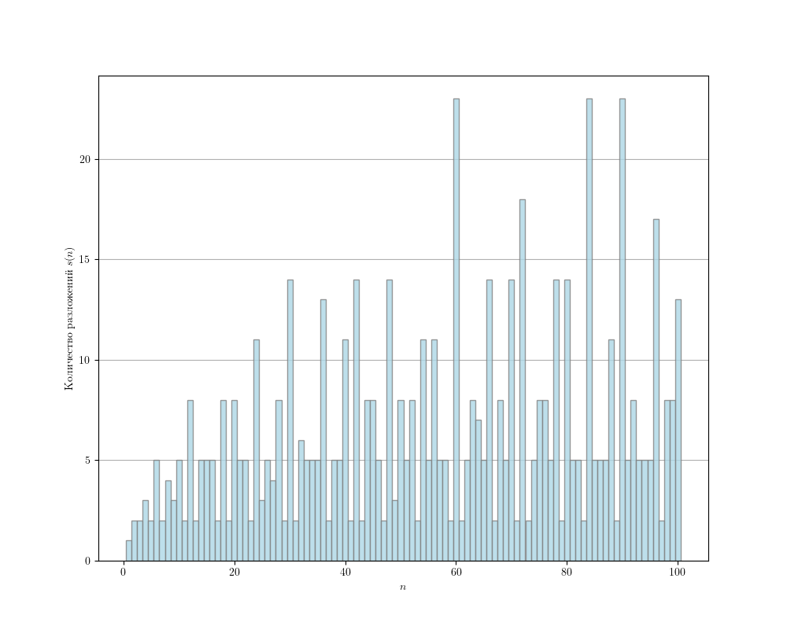

= Обратные числа Диофанта
citrux
22.02.2020
:toc: macro

[abstract]
--
В этой статье рассмотрим решение задач 108 и 110 Project Euler
--

Задача https://projecteuler.net/problem=108[108] с https://projecteuler.net/[projecteuler.net] звучит так:

____
В представленном ниже равенстве $ x $, $ y $ и $ n $ являются целыми положительными числами.

[env.equation]
--
\frac{1}{x} + \frac{1}{y} = \frac{1}{n}
--

При $ n = 4 $ существуют ровно три различных решения:

[env.equation]
--
\begin{array}{l}
\frac{1}{5} + \frac{1}{20} = \frac{1}{4}\\ \\
\frac{1}{6} + \frac{1}{12} = \frac{1}{4}\\ \\
\frac{1}{8} + \frac{1}{8} = \frac{1}{4}
\end{array}
--

Каково наименьшее значение $ n $, при котором число различных решений превышает одну тысячу?

Примечание: Данная задача является более простым вариантом https://projecteuler.net/problem=110[110-й] задачи. Перед тем, как браться за нее, настоятельно рекомендуем Вам решить данную задачу.
____

В https://projecteuler.net/problem=110[110] задаче требуется найти наименьшее $ n $, при котором число различных решений превышает 4 миллиона.

Обозначим $ s(n) $ число различных решений уравнения

[env.equation]
--
\frac{1}{x} + \frac{1}{y} = \frac{1}{n}
--

Задача состоит в нахождении наименьшего $ n $, для которого $ s(n)>1000 $.

Найдём связь между $ x $ и $ y $:

[env.equation]
--
\frac{1}{y} = \frac{1}{n}-\frac{1}{x},\\
y = \frac{xn}{x-n} = n + \frac{n^2}{x-n},
--

[env.equation]
--
\left\{
\begin{array}{l}
x = n + k,\\
y = n + n^2/k
\end{array}
\right.
--

Отсюда, $ s(n) $ равно числу делителей $ n^2 $ из отрезка $ [1, n] $. Это число можно вычислить непосредственно, проверяя остаток от деления  $ n^2 $ на каждое из чисел этого диапазона:

[source,python]
----
def solutions(n):
    return sum(n**2 % k == 0 for k in range(1, n+1))
----

А теперь можно в цикле пробежаться по натуральным числам и остановиться на первом, у которого число решений будет больше 1000:

[source,python]
----
def minimal(s):
    n = 1
    while solutions(n) <= s:
        n += 1
    return n
----

Что-то долго считается. Давайте проведём замеры времени на меньших входных данных:

image::time.png[scalewidth=100]

Для $ s=1000 $ вычисления должны занять $ \sim 10^4 $ секунд, т.е пару-тройку часов, что конечно не устраивает нас. Можно написать этот код на C, что позволит уложиться в приемлемое время для 1000, но проблему с 4000000 из 110 задачи это не решит.

Почему всё так плохо? Функция `minimal(s)` имеет сложность $ O(n^2) $, где $ n $ -- это искомое число, при этом $ n $ быстро растёт с ростом $ s $:

Давайте внимательно посмотрим на зависимость $ s(n) $:

Функция ведёт себя очень интересно. Можно выделить числа с аномально большими значениями $ s(n) $ по отношению к своим соседям: $ 6,\ 12,\ 24,\ 30,\ 60,\ldots $ Также видно большие группы чисел с одинаковыми значениями. Например, $ s = 2 $ для $ 2,\ 3,\ 5,\ 7,\ 11,\ 13,\ 17,\ldots $ Нетрудно увидеть, что это простые числа. Действительно, у квадрата простого числа $ p $ только $ 3 $ делителя -- $ 1,\ p\ \text{и}\ p^2 $, поэтому $ p^2 = 1\cdot p^2 = p\cdot p $ и есть только 2 варианта разложения $ 1/p $:
[env.equation]
--
\frac{1}{p} = \frac{1}{p+1}\ \frac{1}{p+p^2},\quad
\frac{1}{p} = \frac{1}{2p}\ \frac{1}{2p}
--
Ещё бросаются в глаза группы с $ s = 5 $ ($ 6,\ 10,\ 14,\ 15,\ 16,\ldots $) и $ s = 8 $ ($ 12,\ 18,\ 20,\ 28\ldots $).

В первой группе все числа либо имеют 2 простых делителя ($ 6=2\cdot 3 $, $ 15=3\cdot 5 $), либо 1, но входящий в 4 степени ($ 16 = 2^4 $, $ 81 = 3^4 $). Числа вида $n^2 = (p_1\cdot p_2)^2 $ имеет 9 делителей: $ 1,\ p_1,\ p_1^2,\ p_2,\ p_2^2,\ p_1\cdot p_2,\ p_1^2\cdot p_2,\ p_1\cdot p_2^2,\ p_1^2\cdot p_2^2 $. Аналогично, 9 делителей имеет число $ \left(p^4\right)^2 = p^8 $. А раз число $ n^2 $ имеет 9 делителей, но они образуют 5 пар вида $ a_1\cdot a_2 = n^2 $, т.к $ n $ будет парой самому себе.

Во второй группе представлены числа вида $ p_1^2\cdot p_2 $. Кажется, всё дело в простых множителях и степенях, в которых они входят в разложение данного числа.

А что насчёт $ 6,\ 12,\ 24,\ 30,\ 60,\ldots $? Почему для них $ s(n) $ заметно больше, чем у соседей? Посмотрим их разложения:

[env.equation]
--
\begin{array}{rcl}
6 & = & 2\cdot 3,\\
12 & = & 2^2\cdot 3,\\
24 & = & 2^3\cdot 3,\\
30 & = & 2\cdot 3\cdot 5,\\
60 & = & 2^2\cdot 3\cdot 5.
\end{array}
--
Это подтверждает мысль, что нужно смотреть на разложение числа $ n $ на простые множители.

Согласно основной теореме арифметики, число $ n $ можно разложить на простые множители

[env.equation]
--
n = \prod_{i=1}^m p_i^{d_i},
--
где $ m $ -- число простых делителей $ n $, $ p_i $ -- простые числа. Тогда

[env.equation]
--
n^2 = \prod_{i=1}^m p_i^{2d_i}
--
Теперь посчитаем количество делителей $ n^2 $. Число является делителем, если любой его простой множитель $ p_i $ встречается в $ n^2 $ в степени, не превышающей $ 2d_i $. То есть для каждого простого множителя $ p_i $ есть $ |\{0, 1, \ldots, 2d_i\}| = 2d_i+1 $ вариантов, а всего делителей $ \displaystyle\prod_{i=1}^m(2d_i+1) $. Также, заметим, что число всех делителей $ n^2 $ равно $ 2s(n)-1 $. Отсюда,

[env.equation]
--
2s(n) - 1 = \prod_{i=1}^m(2d_i+1),\\
s(n) = \frac{1}{2}\left[1+\prod_{i=1}^m(2d_i+1)\right].
--

Получаем следующую задачу минимизации

[env.equation]
--
\left\{
\begin{array}{l}
\displaystyle\prod_{i=1}^m p_i^{d_i} \to \min,\\
\displaystyle\prod_{i=1}^m(2d_i+1) > 1999,
\end{array}
\right.
--

Добавление нового простого множителя к числу увеличивает число его делителей в $ 2\cdot 1 + 1 = 3 $ раза. Поэтому можно достаточно просто подобрать число, удовлетворяющее условию $ \displaystyle\prod_{i=1}^m(2d_i+1) > 1999 $:

[source,python]
----
PRIMES = [2, 3, 5, 7, 11, 13, 17, 19, 23, 29, 31, 37, 41, 43, 47]
divisors = 1
n = 1
for p in PRIMES:
    n *= p
    divisors *= 3
    if divisors > 1999:
        break
print(n)
----

Нетрудно видеть, что это произведение первых $ \lceil\log_3 2s\rceil $ простых чисел. Но вряд ли оно будет наименьшим среди всех чисел, удовлетворяющих ему. Поэтому нам нужно перебрать различные варианты $ \{d_i\} $ не длиннее построенного выше.

Каждое из значений $ d_i $ имеет смысл перебирать в диапазоне $ [0, \log_{d_i}n] $, так как при больших значениях $ d_i $ будет получаться число, превышающее $ n $, что нас не устраивает. Получаем вот такой вот перебор

[source,python]
----
from math import prod, log
from itertools import product

PRIMES = [2, 3, 5, 7, 11, 13, 17, 19, 23, 29, 31, 37, 41, 43, 47]

def number(degrees):
    return prod(p ** d for p, d in zip(PRIMES, degrees))

def divisors(degrees):
    return prod(2 * d + 1 for d in degrees)

def minimal(s):
    m = int(log(2*s)/log(3)) + 1
    n = prod(PRIMES[:m])

    ranges = [range(0, int(log(n) / log(PRIMES[i])) + 1) for i in range(m)]
    for degrees in product(*ranges):
        if divisors(degrees) > 2 * s - 1:
            n_ = number(degrees)
            if n_ < n:
                n = n_
    return n
----

Функция `product(*iterables)` возвращает итератор по декартову произведению множеств-аргументов. В нашем случае это позволяет нам перебрать наборы степеней простых множителей $ \{d_i\} $, являющиеся элементами пространства $ \displaystyle\prod_{i=1}^m \{0, 1,\ldots, \lceil \log_{p_i}n\rceil\} $.

`minimal(1000)` выполняется за 9 с. Искомое число $180180 = 2^2 \cdot 3^2 \cdot 5^1 \cdot 7^1 \cdot 11^1 \cdot 13^1 $ имеет $ 5^2 \cdot 3^4 = 2025 $ делителей и, соответственно, 1013 способов разложения.

image::time2.png[]

Мы смогли решить 108 задачу, но 110 таким способом явно не решить, нужно что-то получше. Проблема в том, что $ \displaystyle\prod_{i=1}^m \{0, 1,\ldots, \lceil \log_{p_i}n\rceil\} $ содержит огромное количество заведомо неподходящих наборов $ \{d_i\} $.

Количество делителей числа зависит только от количества и значений степеней его простых делителей и не зависит от самих делителей. Так, например, $ 12 = 2^2 \cdot 3^1 $ и $ 75 = 3^1 \cdot 5^2 $ имеют по

[env.equation]
--
s(12) = s(75) = (1 + (2 \cdot 2 + 1) \cdot (2 \cdot 1 + 1)) / 2 = 8
--
способов разложения, но наименьшим из всех чисел с $ s(n) = 8 $ является 12, так как 2 и 3 -- наименьшие из возможных простых множителей. Таким образом, для получения наименьшего $ n $, соответствующего данному набору $ \{d_i\} $ необходимо отсортировать $ \{d_i\} $ по убыванию, а в качестве $ \{p_i\} $ выбрать первые $ m $ простых чисел в порядке возрастания.

То есть можно заметно ускорить перебор, производя его только по подходящим наборам $ \{d_i\} $.

[source,python]
----
from math import prod

PRIMES = [2, 3, 5, 7, 11, 13, 17, 19, 23, 29, 31, 37, 41,
          43, 47, 53, 59, 61, 67, 71, 73, 79, 83, 89, 97]

def number(degrees):
    return prod(p ** d for p, d in zip(PRIMES, degrees))

def divisors(degrees):
    return prod(2 * d + 1 for d in degrees)

def to_string(degrees):
    return ' • '.join(f'{p}^{d}' for p, d in zip(PRIMES, degrees) if d)

def minimal(s):
    # constructive initial guess
    result = []
    while divisors(result) <= 2 * s - 1:
        result.append(1)
    n = number(result)
    m = len(result)

    # let's get it
    i = 0
    guess = [0] * m
    while i > -1:
        guess[i] += 1
        n_ = number(guess)

        if (i and guess[i] > guess[i - 1]) or n_ > n:
            # if state is unordered, make it ordered by
            # setting value to 0 and move to previous degree
            #
            # if current value is greater, than already found,
            # also go to smaller prime factors
            guess[i] = 0
            i -= 1
            continue

        if divisors(guess) > 2 * s - 1:
            # if smaller than previous result, update it
            if n_ < n:
                result = guess[:]
                n = n_
            # we don't need to make number bigger,
            # because it already has at least s solutions
            guess[i] = 0
            i -= 1
        else:
            # not enough solutions, go to next factor
            if i < m - 1:
                i += 1
    return result
----

Этот подход, позволяет решить 110 задачу за 154 мс!

image::time3.png[]

