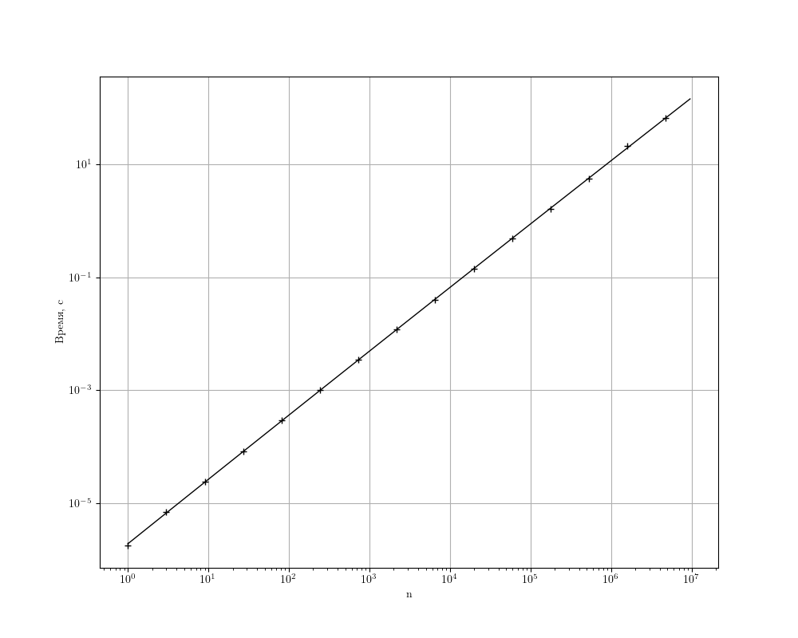
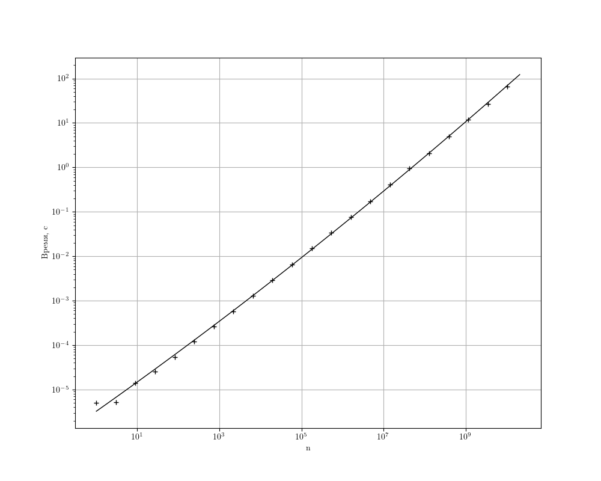
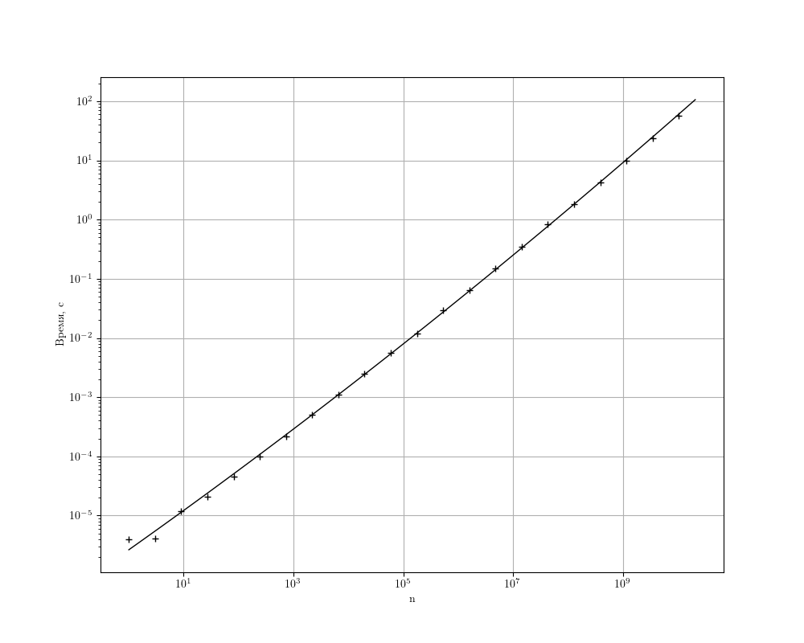

= Бесквадратные множители
citrux
04.07.2021
:toc: macro

[abstract]
--
В этой статье рассмотрим решение задачи 362 Project Euler
--

Задача https://projecteuler.net/problem=362[362] с https://projecteuler.net/[projecteuler.net] звучит так:

____
Рассмотрим число $54$. $54$ может быть разложено $7$ различными способами на один или несколько множителей больше $1$: $54$, $2 \cdot 27$, $3 \cdot 18$, $6 \cdot 9$, $3 \cdot 3 \cdot 6$, $2 \cdot 3 \cdot 9$, $2 \cdot 3 \cdot 3 \cdot 3$.
Если мы потребуем, чтобы все множители были бесквадратные, останется только два способа: $3 \cdot 3 \cdot 6,\ 2 \cdot 3 \cdot 3 \cdot 3$.

Назовём $\mathrm{Fsf}(n)$ количество способов разложения числа $n$ на один или больше бесквадратных множителей больше 1. Таким образом, $\mathrm{Fsf}(54) = 2$.

Пусть $S(n) = \displaystyle\sum_{k=2}^n \mathrm{Fsf}(k)$. Например, $S(100) = 193$.

Найдите $S(10^{10})$.
____

Сразу понятно, что решать задачу прямым расчётом суммы по проедложенной формуле бесполезно, так как это займёт уйму времени. Взглянем на проблему с другой стороны: что из себя представляет число $S(n)$? Это количество разложений на бесквадратные множители всех чисел от 2 до n включительно. Можно решить эту задачу следующим образом: найти бесквадратные числа и посчитать количество их произведений, не превышающих n.

Пусть у нас есть последовательность $\{sf\} = \{2, 3, 5, 6, 7, 10, \ldots\}$ бесквадратных чисел. Рассмотрим множество различных комбинаций элементов $\{sf\}$ -- множество разложений на бесквадратные множители, и обозначим $F(i, n)$ его подмножество, разложения которого не содержат множителей меньших $sf_i$ и соответствуют числам, не превышающим $n$. Например, $F(0, 5) = \{(2), (3), (2, 2), (5)\}$, а $F(1, 5) = \{(3), (5)\}$, т.к не содержат $sf_0 = 2$. Нетрудно заметить, что $S(n) = |F(0, n)|$, но как посчитать количество этих разложений?

$F(i, n)$ состоит из:

1. разложений, в которых нет множителя $sf_{i}$, множеством которых является $F(i+1, n)$
2. разложений, в которых он присутствует: это само число $sf_i$ и множество $\{sf_i\} \times F(i, \lfloor n / sf_i \rfloor)$

[env.equation]
--
|F(i, n)| = |F(i+1, n)| + 1 + |F(i+1, \lfloor n / sf_i \rfloor)|
--

Рекурсия есть, теперь нужна её база. Очевидно, что $F(j, n) = 0$ для всех $j$, при которых $sf_j > n$.

Вырисовывается алгоритм, вопрос лишь в том, как получить последовательность бесквадратных чисел. Для этого можно получить простые числа решетом Эратосфена, а затем с их помощью похожим образом просеять бесквадратные числа:

[source,python]
----
def sieve(n):
    flags = [False, False] + [True] * (n - 1)
    for i in range(2, n + 1):
        if not flags[i]:
            continue
        for j in range(2 * i, n + 1, i):
            flags[j] = False

    return [i for i, is_prime in enumerate(flags) if is_prime]

def squarefree_sieve(n):
    flags = [False, False] + [True] * (n - 1)
    primes = sieve(n)
    for i in range(2, n + 1):
        for p in primes:
            if i * p > n:
                break
            if i % p == 0:
                flags[i * p] = False
                break
            flags[i * p] = flags[i]

    return [i for i, is_prime in enumerate(flags) if is_prime]
----

`squarefree_sieve` возвращает нам список бесквадратных чисел, не превышающих $n$. Теперь можно приступить к подсчёту разложений:

[source,python]
----
SQUAREFREE = []

def f(i, n):
    if i >= len(SQUAREFREE) or SQUAREFREE[i] > n:
        return 0
    return 1 + f(i, n // SQUAREFREE[i]) + f(i + 1, n)

def s(n):
    SQUAREFREE[:] = squarefree_sieve(n)
    return f(0, n)

if __name__ == '__main__':
    n = int(sys.argv[1])
    print(s(n))
----

Неплохо, но есть проблема. У нас тут плохая рекурсия, что в случае с питоном приведёт к ошибке о превышении максимальной глубины рекурсии уже для $n = 1634$. Обойти это ограничение совсем несложно -- уйдём от рекурсии с помощью стека и мемоизации:

[source,python]
----
F = {}

def f(i, n):
    stack = [(i, n)]
    while stack:
        i, n = stack[-1]
        if (i, n) in F:
            stack.pop()
            continue

        if i >= len(SQUAREFREE) or SQUAREFREE[i] > n:
            F[(i, n)] = 0
            stack.pop()
            continue

        x = F.get((i, n // SQUAREFREE[i]))
        y = F.get((i + 1, n))

        if x is None:
            stack.append((i, n // SQUAREFREE[i]))
            continue
        if y is None:
            stack.append((i + 1, n))
            continue
        F[(i, n)] = 1 + x + y
    return F[(i, n)]
----

Исследуем зависимость времени выполнения от входных данных --  числа $n$:
ifdef::backend-html5[]
++++
include::time_improved.svg[]
++++
endif::[]

ifndef::backend-html5[]

endif::[]

Этим способом мы не сможем посчитать ответ к задаче, нужен способ ускорить вычисление.

Заметим, что в если $sf_i > \sqrt{n}$, то это всегда наибольший множитель в разложении, поэтому $F(i, n) = \{(sf_i): sf_i > \sqrt{n}, sf_i \le n\}$. При этом количество бескадратных, не превышающих $n$ можно посчитать, не генерируя весь список. Квадраты в своём разложении на множители содержат каждое $4,\ 9,\ 16,\ 25,\ \ldots$ числа. Проблема в том, что например, каждое $36$ число будет учтено как минимум $3$ раза: как каждое $4$, $9$ и $36$.

Так как каждое число раскладывается на простые множители, то достаточно рассматривать квадраты простых чисел. Каждое $4$ число делится на $4$, поэтому их $\lfloor n/4 \rfloor$, каждое $9$ -- на $9$, и их $\lfloor n/9 \rfloor$, но при этом каждое $4$ из них уже учтенов предыдущих $\lfloor n/4 \rfloor$, поэтому нас интересуют только $\lfloor n/9 \rfloor - \lfloor \lfloor n/9 \rfloor /4 \rfloor$.

Обозначим $g(i, n)$ количество чисел от $1$ до $n$, делящихся на $p_i^2$ и при этом взаимно простых со всеми $p_j < p_i$. Тогда легко получить рекуррентное соотношение

[env.equation]
--
g(i, n) = \left\lfloor\frac{n}{p_i^2}\right\rfloor - \sum_{j=0}^{i-1} g\left(j, \left\lfloor\frac{n}{p_i^2}\right\rfloor\right)
--

Получаем 

[source,python]
----
def g(i, n):
    if PRIMES[i] * PRIMES[i] > n:
        return 0

    k = n // (PRIMES[i] * PRIMES[i])
    return k - sum(g(j, k) for j in range(i))

@cache
def count(n):
    nonsquarefree_count = 1
    for i, p in enumerate(PRIMES):
        if p * p > n:
            break
        nonsquarefree_count += g(i, n)
    return n - nonsquarefree_count

def f(i, n):
    stack = [(i, n)]
    while stack:
        i, n = stack[-1]
        if (i, n) in F:
            stack.pop()
            continue

        if i >= len(SQUAREFREE) or SQUAREFREE[i] > n:
            F[(i, n)] = 0
            stack.pop()
            continue

        if SQUAREFREE[i] * SQUAREFREE[i] > n:
            F[(i, n)] = count(n) - i
            stack.pop()
            continue

        x = F.get((i, n // SQUAREFREE[i]))
        y = F.get((i + 1, n))

        if x is None:
            stack.append((i, n // SQUAREFREE[i]))
            continue
        if y is None:
            stack.append((i + 1, n))
            continue
        F[(i, n)] = 1 + x + y
    return F[(i, n)]
----

ifdef::backend-html5[]
++++
include::time_improved2.svg[]
++++
endif::[]

ifndef::backend-html5[]

endif::[]

Уже значительно лучше, но, быть может мы сможем улучшить результат? Рекурсия в $g(i, n)$ выглядит не очень.

Посмотрим, сколько бесквадратных чисел среди первых $30$: это $2$, $3$, $5$, $6$, $7$, $10$, $11$, $13$, $14$, $15$, $17$, $19$, $21$, $22$, $23$, $26$, $29$, $30$, итого $18$ штук. С другой стороны $30 - 1 - \lfloor 30/4 \rfloor - \lfloor 30/9 \rfloor - \lfloor 30/25 \rfloor = 29 - 7 - 3 - 1 = 18$.

А теперь среди первых $42$: к первым $18$ добавятся $31$, $33$, $34$, $35$, $37$, $38$, $39$, $41$, $42$, итого $27$. При этом $42 - 1 - \lfloor 42/4 \rfloor - \lfloor 42/9 \rfloor - \lfloor 42/25 \rfloor = 41 - 10 - 4 - 1 = 26$. Тут дело в том, что $36$ мы учли дважды: как делящееся на $4$ и на $9$. Добавив к результату $ \lfloor 42/36 \rfloor = 1$ мы получим правильный ответ.

Вообще для любого $k = p_i \cdot p_j$ числа, делящиеся на $k^2$ будут учтены дважды среди чисел, делящихся на $p_i^2$ и $p_j^2$, поэтому к результату нужно добавлять $\lfloor n/k^2 \rfloor$.

Рассмотрим теперь числа вида $l = p_i \cdot p_j \cdot p_k$. Делящиеся на их квадраты числа будут учтены $C_3^1 = 3$ раза для каждого их простого множителя и $C_3^2 = 3$ раза для множителей, являющихся произведениями двух простых. Поэтому для правильного подсчёта нужно дополнительно вычесть $\lfloor n/l^2 \rfloor$.

Похоже мы уловили суть: добавление нового простого множителя приводит к смене знака у слагаемого. Проверим эту гипотезу. Пусть у нас есть число вида $q = p_1 \cdot p2 \cdot \ldots \cdot p_m$. Тогда оно было учтено $C_m^1 - C_m^2 + \ldots - (-1)^{m-1} C_m^{m-1} = 1 + (- 1)^m$ раз. То есть для чётных $m$ числа делящиеся на $q^2$ учитываются $2$ раза, а для нечётных -- ни разу. Поэтому для чётных $m$ нужно дополнительно добавить $\lfloor n/l^2 \rfloor$, а для нечетных вычесть $\lfloor n/l^2 \rfloor$, то есть наша догадка верна!

При этом проблемные числа, дополнительный учёт которых приходится производить, являются бесквадратными числами, так как каждый простой множитель входит в них в первой степени. Таким образом,
[env.equation]
--
\left|\{x: x \in \{sf_i\}, x \le \sqrt{n} \}\right| = n - 1 + \sum_{i=0}^n s_i \left\lfloor\frac{n}{i^2}\right\rfloor,
--
где
[env.equation]
--
s_i = \left\{
    \begin{array}{ll}
        (-1)^m, & \text{если i -- бесквадратное, и имеет m простых делителей}, \\
        0 & \text{иначе}.
    \end{array}
    \right.
--
Для генерации последовательности $s_i$ слегка усовершенствуем код `squareless_sieve`:

[source,python]
----
def squarefree_signs(n):
    s = [0, 0] + [-1] * (n - 1)
    primes = sieve(n)
    for i in range(2, n + 1):
        for p in primes:
            if i * p > n:
                break
            if i % p == 0:
                s[i * p] = 0
                break
            s[i * p] = -s[i]
    return s
----

Ну и перепишем метод `count`:

[source,python]
----
@cache
def count(n):
    result = n - 1
    for i, sign in enumerate(SQUAREFREE_SIGNS):
        if i < 2:
            continue
        if i * i > n:
            break
        result += sign * n // (i*i)
    return result
----

ifdef::backend-html5[]
++++
include::time_final.svg[]
++++
endif::[]

ifndef::backend-html5[]

endif::[]

Мы справились быстрее, чем за минуту!

На этом у меня сегодня всё. Референсы добавлю потом.
